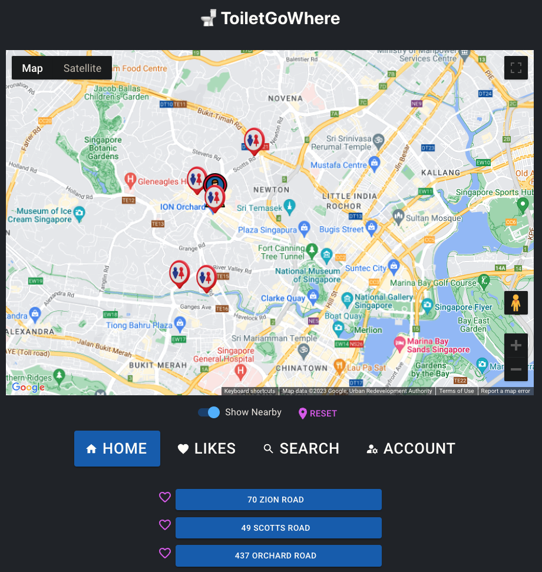
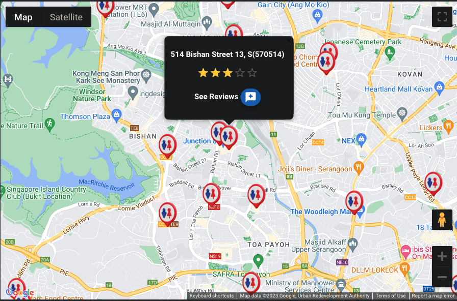
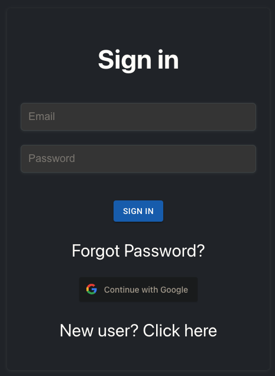
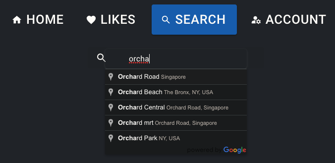
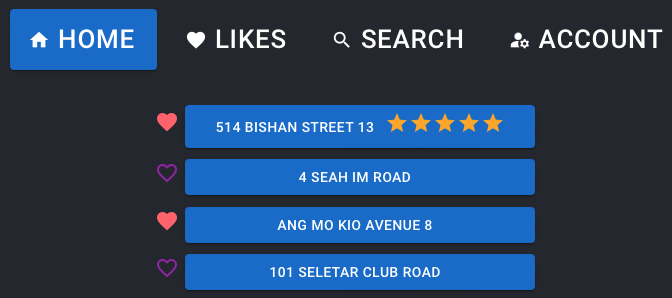
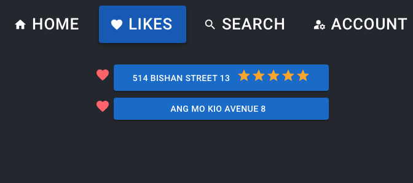
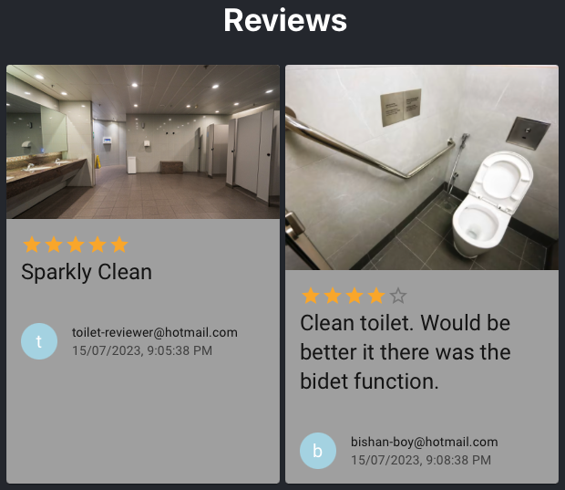

# 🚽 ToiletGoWhere

## ❓ Overview

A WebApp that allows users to look for the best toilets in Singapore and rate them, enabling users to find clean accessible restrooms.

_Screenshot of a user searching for nearby toilets near Orchard Road_

## 💻 Technologies Used

🚽 ToiletGoWhere is built using the following technologies:

- React: A JavaScript library for building user interfaces.
- React Router: Used to enable client-side routing.
- Google Maps API: Used for displaying maps, markers, and providing location-based services.
- Firebase Authentication: Handles user authentication and account management.
- Geolib: Library that provides basic geospatial operation.
- Material UI: Offers a comprehensive suite of UI tools.

## 📚 What we learnt

- To build a React app with functional components.
- To apply React Router to enable client-side router. We used the useParams function to allow Web Page information (i.e. Reviews for a specified toilet, the navbar button that was clicked) to persist even after the user refreshes the page.
- To leverage Google Maps and Places API in our app to provide real-time navigational features and location suggestions to users.
- To use Firebase products such as Realtime Database and Storage to build the backend. We also used Firebase Authentication to provide user identity for our app. The user identity is used to associate the users liked toilets and reviews with the users.
- To use Material UI's components to build a beautiful app. We used icons to further highlight what each of our app components does or shows.
- To leverage third-party libraries like Geolib to perform geospatial computation. We used Geolib's orderByDistance function to sort the nearest toilets to the user's or searched location by coordinates.

## 📜 Available Scripts

To run the 🚽 ToiletGoWhere locally, follow these steps:

1. Clone the repository: git clone <repository-url>
2. Navigate to the project directory: cd toilet-finder-app
3. Install dependencies: npm install
4. Start the development server: npm start
5. Open your browser and visit: http://localhost:3000
   Make sure you have Node.js and npm installed on your machine before proceeding with the installation.

## 🌈 Features

- **Toilets and User Location Display on Google Maps:**
  The app integrates with Google Maps to visually display the locations of toilets. Users can see their current location and explore nearby toilet facilities and their average rating.

  

- **Show Nearby Toilets:**
  The app provides the functionality to show nearby toilets based on the user's current location. Users can easily find toilets in their vicinity and get directions to the selected toilet.

- **User Authentication:**
  Users can create an account and authenticate themselves to access additional features. Authentication ensures a personalized experience and allows users to save their preferences and interact with the app securely.

  

- **Basic Search Functionality:**
  Allow users to search for nearby toilets from the specified search address. This feature enables users to plan ahead.

  

- **Save Toilets' Location as Likes:**
  Authenticated users can save toilets' locations as their favorites. This feature enables users to bookmark toilets they frequently visit or find particularly useful for future reference.

  

  

- **Review Toilets + See Reviews:**
  Users can submit reviews and ratings for toilets they have visited. This enables users to share their experiences and provide valuable feedback to other users. Additionally, users can view reviews submitted by others to make informed decisions about the quality and suitability of toilets.

  

- **Mobile Reponsive:**
  The app provides a responsive display that allows users to use the app on a PC or mobile. This enables users to have a seamless experience of using the app in one place or on the go.

  

## 📱 Wire Frame (MVP)

## 🧠 ERD

## 💽 Data Source

The toilet locations used in this app are sourced from the [Singapore Toilet Map Directory](https://www.toilet.org.sg/loomapdirectory). The data provided by this source ensures accurate and up-to-date information about toilet facilities in Singapore.

## 🔮 Future Enhancements

Here are some possible enhancements and additional features to be implemented in the future:

- Advanced Search Functionality: Allow users to search for toilets based on specific criteria such as accessibility features, availability, cleanliness ratings, etc.
- Filtering and Sorting: Provide options for users to filter and sort toilet results based on their preferences.
- Directions and Navigation: Integrate with a mapping service to provide directions and navigation to the selected toilet.
- Social Sharing: Enable users to share toilet locations, ratings, and reviews with others through social media or messaging platforms.
- Real-time Updates: Implement real-time data updates to keep toilet information, ratings, and availability up-to-date.
- User Notifications: Send notifications to users about new toilet locations, updates to their liked toilets, responses to their reviews, etc.

Feel free to contribute to the project by adding new features, fixing bugs, or suggesting improvements. We appreciate your feedback and contributions!

## 🗣 Acknowledgements

- [Singapore Toilet Map Directory](https://www.toilet.org.sg/loomapdirectory) for providing the toilet location data.
- [Google Maps Platform](https://developers.google.com/maps) for the mapping services.
- [Firebase](https://firebase.google.com/) for data management, user authentication and account management.
- [Geolib](https://www.npmjs.com/package/geolib) for the geospatial function to sort coordinates.

## 📲 Contact

For any inquiries or suggestions, please contact the project team at [toiletgowhere.app@gmail.com].

We hope you find 🚽 ToiletGoWhere useful and have a pleasant experience locating toilets nearby!
