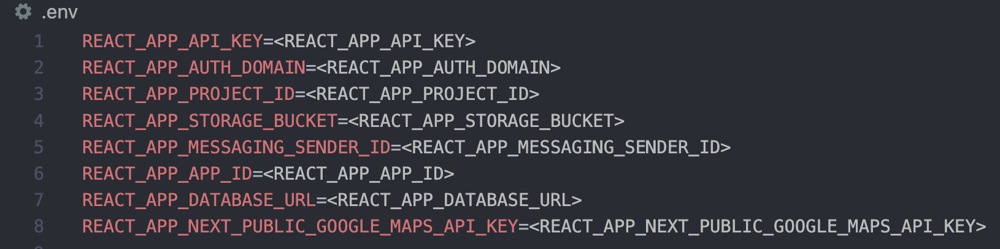
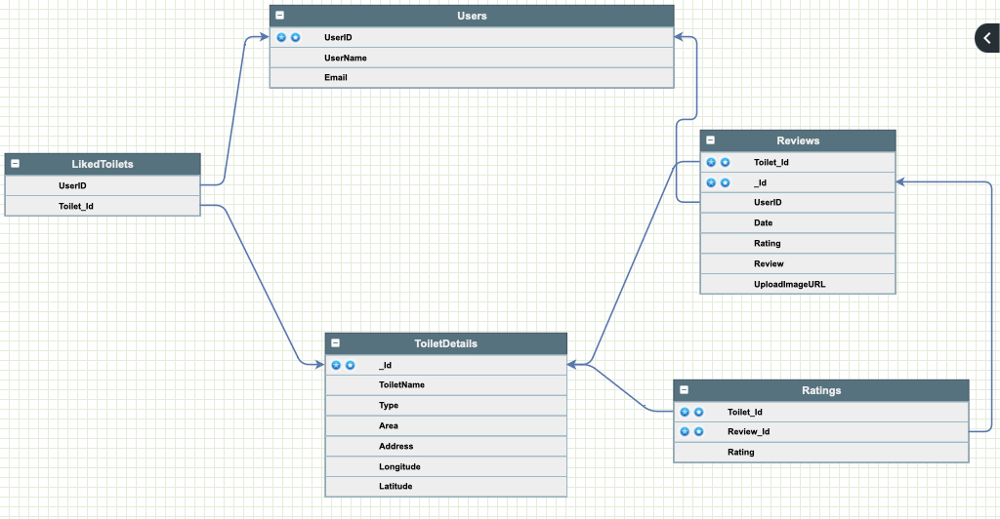

# 🚽 ToiletGoWhere

## ❓ Overview

A WebApp that allows users to look for the best toilets in Singapore and rate them, enabling users to find clean accessible restrooms.

## 📚 What we learnt

- To build a React app with functional components.
- To use Material UI to build the UI Components of the app.
- To leverage Google Maps and Places API to provide real-time navigational features and location suggestions to users.
- To apply React Router, enabling client-side routing. We used the useParams function to allow WebPage information to persist after user refreshes the page.
- To leverage third-party libraries like Geolib to perform geospatial computation. We used Geolib's orderByDistance function to sort the nearest toilets to the user's or searched location by coordinates.
- To use Firebase products such as Realtime Database and Storage to build the backend, Firebase Authentication to provide user identity for our app, and Firebase Hosting to host this app.

## 📜 Running in local

To run the 🚽 ToiletGoWhere locally, follow these steps:

1. Install dependencies: npm install
2. Start the development server: npm start
3. Create a .env file like below and fill in your firebase credentials

Make sure you have Node.js and npm installed on your machine before proceeding with the installation.

## 🌈 Features

- Toilets and User Location Display on Google Maps: Users can see their current location and toilets in Singapore along with their rating and reviews.
- Show Nearby Toilets: Show nearby toilets based on the user's current or searched location.
- User Authentication: Users can create an account and authenticate themselves to access additional features for a personalized experience.
- Search: Allow users to search for nearby toilets from the specified search address.
- Save Toilets' Location: Authenticated users can save toilets' locations as their favorites.
- Review Toilets + See Reviews: Users can submit reviews and ratings for toilets they have visited. Other users are able to see reviews submitted in real-time.

## 💻 Technologies Used

🚽 ToiletGoWhere is built using the following technologies:

- React: A JavaScript library for building user interfaces.
- React Router: Used to enable client-side routing.
- Google Maps API: Used for displaying maps, markers, and providing location-based services.
- Firebase: Handles database, storage, user authentication, account management and app hosting.
- Geolib: Library that provides basic geospatial operation.
- Material UI: Offers a comprehensive suite of UI tools.

## 📱 Wire Frame (MVP)

## 🧠 ERD

## 💽 Data Source

The toilet locations used in this app are sourced from the [Singapore Toilet Map Directory](https://www.toilet.org.sg/loomapdirectory).

## 🔮 Future Enhancements

Possible enhancements and additional features:

- Filtering and Sorting: Provide options for users to filter and sort toilet results based on their preferences.
- Directions and Navigation: Integrate with a mapping service to provide directions and navigation to the selected toilet.
- Social Sharing: Enable users to share toilet locations, ratings, and reviews with others through social media or messaging platforms.
- Real-time Updates: Implement real-time data updates to keep toilet information and availability up-to-date.
- User Notifications: Send notifications to users about new toilet locations, updates on their liked toilets, responses to their reviews.

Feel free to submit a pull request and contribute to the project by adding new features, fixing bugs, or suggesting improvements.

## 📲 Contact

For any inquiries or suggestions, please contact the project team at [toiletgowhere.app@gmail.com].
